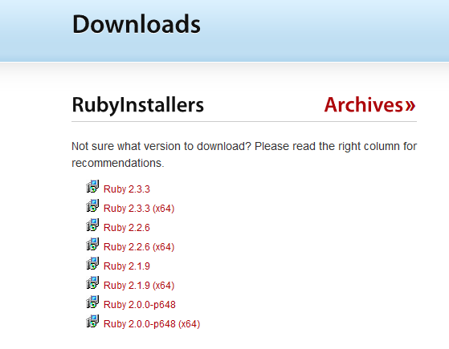
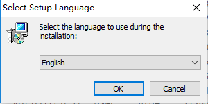
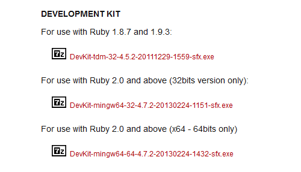
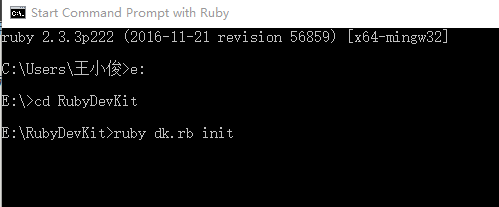
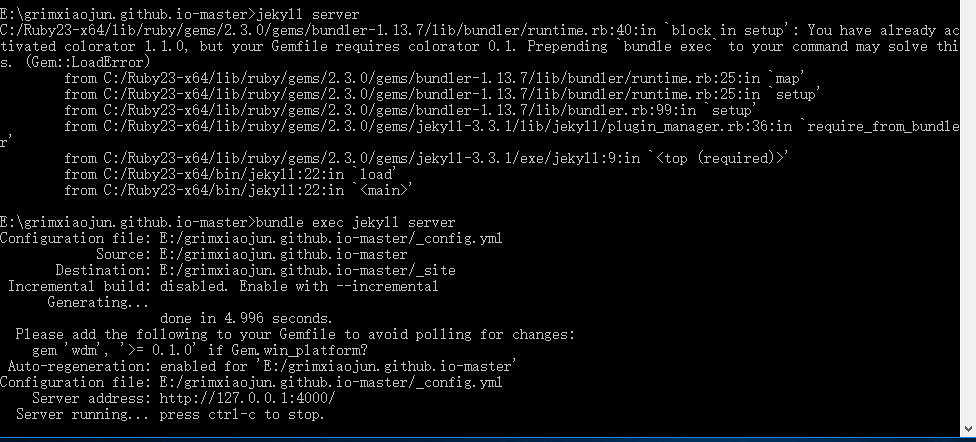

# 欢迎来到我的个人博客

这是我在github上的第一篇博客，这一篇博客我将讲述我怎么想来到github上写自己的博客的和如何在github上搭建个人博客的过程

- 首先我之前写博客是在CSDN上写，在途中感觉CSDN支持的Markdown简直是太low了，他的中英文切换时竟然自动直接切到了最下面一行，这是最不能忍受的，当我打着字切换了一下中英文输入法，变到了最下面一行，试问一个想成为一个好的程序员的我怎么能继续这样呢。。。不过也有可能是我没发现他的解决方法，不喜勿喷

- 其二在CSDN上搭建出来的博客总感觉差了点味道，总觉得没有自己的个人博客看着舒爽，有时候感觉有点别扭，直观点说就是觉得不太好看，这也是不太能忍的，哈哈哈，毕竟所有人都希望他（她）所写出的博客既美观又实用，能够帮助到人们

  ### 以上便是我来到github上写自己的博客的部分原因

------

下面我将讲述我是如何在github上搭建的个人博客，在这里我将把我走过的弯路都省略，只讲怎么能完美搭建好自己的博客，相信这也是大家想要的（手动滑稽）

#### 总共需要的东西

- 首先你在github上写东西，所以你必须有github账号，会基本的git操作
- 由于我的博客是在WINDOWS下基于jekyll的所以你要下载Ruby（jekyll基于它开发）
- 还要下载与Ruby配套的RubyDevKit
- 我将在下面一步步给你指出你需要的的东西的安装步骤以及安装网址

#### 以上便是你基本需要的东西

<h3>Ruby</h3>

我现在所用是windows所以我用的是[Rubyinstaller](http://rubyinstaller.org/downloads/)安装

无脑式安装，直接下一步就好

<h3>RubyDevKit</h3>

在安装RubyDevKit时，仅仅需要注意的是要与你安装的Ruby版本一致

这是去往[RubyDevKit](http://rubyinstaller.org/downloads/)的链接，下载后直接解压到你想让它在的文件夹下，或者自己创建一个文件夹用以存放

<h3>此时便有一些命令需要去敲了</h3>

首先打开刚才安装好的Ruby命令行，由于我的是windows，所以我直接查看新增，直接就可以看到，并且打开，新的命令行名为‘Start Command Prompt with Ruby’

接着进入刚才解压的RubyDevKit文件夹下配置东西

- 首先输入 ‘ruby dk.rb init’  将会生成一个'config.yml'它的作用是是检测系统安装的ruby的位置并记录在这个文件中

(由于我已安装便不再继续演示此处的安装过程，只要在此界面中按照我的步骤，输入相关命令便可成功)

- 接着 输入  ‘ruby dk.rb install’ 等待一会便将这些配置好了

- 接着就是要安装我们的’jekyll‘了

- 由于现在的Ruby自带gem，所以不用安装gem，可以直接安装jekyll，命令如下 ‘gem install jekyll’此时便将jekyll安装好了

- 测试命令 ‘jekyll server’   若是此处你有下面的错误

- 现在我们的一些配置都已经初步好了，接着就是利用jekyll帮我们初建一个可用于测试的博客

  命令如下 ‘jekyll new Blogname’

- 进入新建文件夹内    启动测试   ‘jekyll server’  此时便打开了‘127.0.0.1:4000’

  此时你在浏览器中输入[http://localhost:4000](http://localhost:4000)便可初试自己的博客，关于你自己的东西你可以在文件夹下的‘_config.yml’中配置

- 到这里本地就已经搭建好了

- 若是测试成功的话会有如下显示

  

或者有一种错误是提示你要在'jekyll server’前加上‘bundle exec’，此时加上便可

即输入命令 ‘bundle exec jekyll server’ 

<h3>下面便是上传到你的github上</h3>

相信只要是想在github上搭建自己的博客的人，应该都对这一步比较熟悉，至少自己肯定将自己的项目或者代码上传到github上共享过，对github有过一定贡献，所以在这里我就不多说

- 在github上新建一个仓库，仓库名随便你设，只要格式符合 ‘username.github.io’ 便可，其中username是你的仓库名，以后访问时也将会在浏览器中直接输入‘username.github.io’便可访问

- 最后就是git的一写操作了，将你的新文件夹初始化，然后利用

  'git add .'  'git commit -m 'comments'  'git push -u origin master'等操作便可上传

  ​

<h3>最后，喜欢就star下呗</h3>

